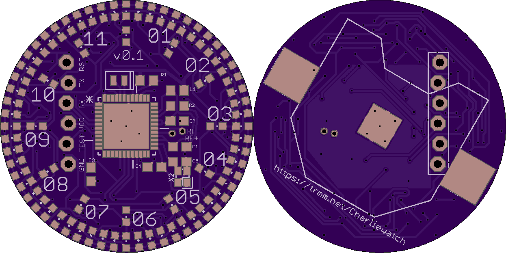

"Analog" watch with 60+12 Charlieplexed LEDs. Based on Travis Goodspeed's
GoodWatch21 schematic, using the CC430F5137IRGZR CPU, which doesn't
have the LCD controller of the CC430F6xxx in the GoodWatch. There are
also pads for a six pin FTDI cable with pogopins for programming or
serial communication.

v0.1 was ordered 2018-09-27, not yet tested.
