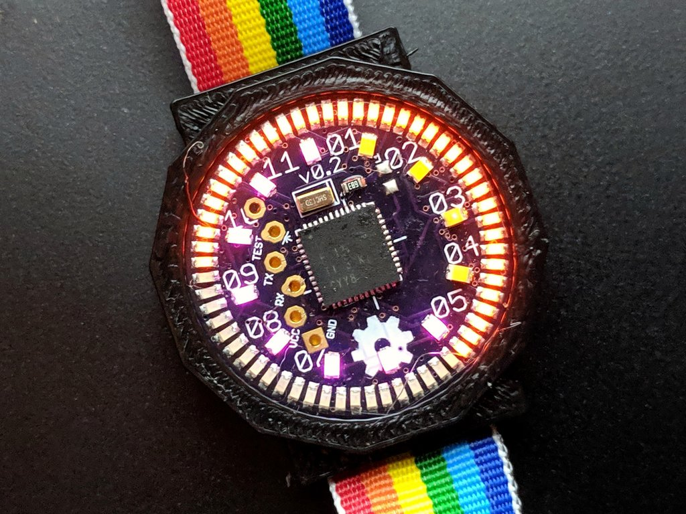
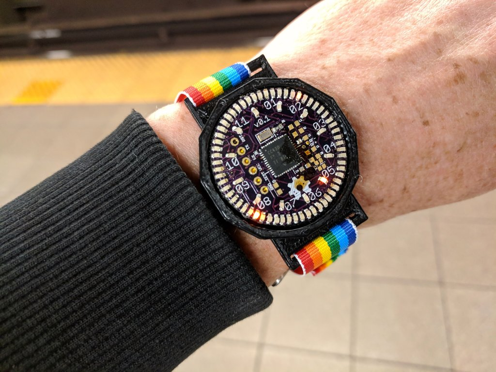

"Analog" watch with 60+12 Charlieplexed LEDs. Based on Travis Goodspeed's
GoodWatch21 schematic, using the CC430F5137IRGZR CPU, which doesn't
have the LCD controller of the CC430F6xxx in the GoodWatch. There are
also pads for a six pin EZfet cable with pogopins for programming or
serial communication.

v0.2 works, although it has no radio parts.  It is exactly 1 square inch
of PCB and should fit in a 38mm or 36mm case.

v0.1 works, although the radio parts have not been tested.  It is a slightly
larger board and fits in a 40mm case.

[Charliewtch schematic](datasheets/charliewatch.pdf)

Building the firmware
-----

Note: some other system packages (boost libraries?) might also be needed.

First, get the toolchain (msp430-gcc):

    sudo apt install gcc-msp430 mspdebug

Then the all-important lib file (from https://www.ti.com/tool/MSPDS):

    sudo apt install libhidapi-dev
    mkdir MSPDebugStack
    wget https://software-dl.ti.com/msp430/msp430_public_sw/mcu/msp430/MSPDS/3_15_1_001/export/MSPDebugStack_OS_Package_3_15_1_1.zip

Copy in the hidapi header (WTFBBQ):

    cp /usr/include/hidapi/hidapi.h ThirdParty/include/

Copy the following into a file 'hidapi.patch', so we can use the system hidapi library:

    --- Makefile    2020-12-18 18:01:18.602942502 +0100
    +++ Makefile.new    2020-12-18 18:02:58.472096541 +0100
    @@ -123,7 +123,7 @@
     OBJS := $(patsubst %.cpp, %.o, $(SRC))
    
     all: $(BSLLIB) $(OBJS)
    -   $(CXX) $(CXXFLAGS) -shared $(OUTNAME)$(OUTPUT) -o $(OUTPUT) $(OBJS) $(HIDOBJ) $(LIBDIRS) $(BSTATIC) $(STATIC_LIBS) $(BDYNAMIC) $(LIBS)
    +   $(CXX) $(CXXFLAGS) -shared $(OUTNAME)$(OUTPUT) -o $(OUTPUT) $(OBJS) -lhidapi-libusb $(LIBDIRS) $(BSTATIC) $(STATIC_LIBS) $(BDYNAMIC) $(LIBS)
        rm -f $(STATICOUTPUT).a
        ar -rs $(STATICOUTPUT).a $(OBJS)

Then apply and make:

    patch < hidapi.patch
    make

Finally, build and flash the firmware:

    git clone https://github.com/osresearch/charliewatch.git
    cd charliewatch/firmware
    make
    export LD_LIBRARY_PATH=$LD_LIBRARY_PATH:`pwd`../../MSPDebugStack/
    mspdebug tilib "prog charliewatch.elf"

Programming cable
-----

From the top of the v0.1 board:
* RST / TDIO
* RXD on programmer
* TXD on programmer
* VCC
* TST / TCK
* GND

v0.2:
* greem
* white
* blue
* purple
* gray
* black

There is also a four-wire setup that might simplify the wiring.
Travis documents it and the power consumption here:
https://github.com/travisgoodspeed/goodwatch/wiki/EnergyTrace

Bricked Launchpad
-----

If you brick your launchpad by running Energia under Linux, it will no
longer program the Charliewatch.  The other weirdness is that `tilib`
can detect the device, but can't write to it unless run as root.

Energy Trace
----
* `libmsp430.so`: https://dlbeer.co.nz/articles/slac460y/index.html
* https://github.com/carrotIndustries/energytrace-util
* Have to update path to `MSP430.h` from the `slac/DLL430_v3/include` directory

